# tomyou-ea

Python + FastAPIでREST APIサーバを構築するテンプレートです。

- [tomyou-ea](#tomyou-ea)
- [概要](#概要)
  - [構成](#構成)
  - [フォルダ構成](#フォルダ構成)
  - [特徴](#特徴)
    - [1. REST APIをテンプレート化して開発を高速化](#1-rest-apiをテンプレート化して開発を高速化)
    - [2. VSCode + DevContainerを使用した仮想環境での開発](#2-vscode--devcontainerを使用した仮想環境での開発)
    - [3. ORMツールを採用](#3-ormツールを採用)
    - [4. 依存性の注入（DI）を採用してテストを簡単に](#4-依存性の注入diを採用してテストを簡単に)
    - [5. ロギングのテンプレート化](#5-ロギングのテンプレート化)
    - [6. 豊富なサンプルコード](#6-豊富なサンプルコード)
- [クイックスタート](#クイックスタート)
    - [事前に必要なもの](#事前に必要なもの)
- [ユーザガイド](#ユーザガイド)
  - [Fast API 基本機能](#fast-api-基本機能)
    - [1. ルーティング](#1-ルーティング)
    - [2. ミドルウェア](#2-ミドルウェア)
    - [3. エラーハンドリング](#3-エラーハンドリング)
    - [4. 認証・認可](#4-認証認可)
    - [5. バリデーション](#5-バリデーション)
    - [6. Cookie](#6-cookie)
    - [7. ファイルアップロード](#7-ファイルアップロード)
  - [DB操作](#db操作)
    - [1. SQL Alchemyとは](#1-sql-alchemyとは)
    - [2. DBからモデル定義をリバースエンジニアリング](#2-dbからモデル定義をリバースエンジニアリング)
  - [その他](#その他)
    - [1. Pythonパッケージング管理ツール](#1-pythonパッケージング管理ツール)
    - [2. 環境変数・設定の読み込み](#2-環境変数設定の読み込み)
    - [3. 依存性の注入（DI）](#3-依存性の注入（di）)
- [リファレンス](#リファレンス)
- [引用](#引用)

# 概要

このテンプレートは、Pythonを使用してFastAPIフレームワークを使い、REST APIサーバを構築するためのテンプレートです。

AIに関するサービスをAPI化したい場合、このテンプレートを素体として使用することで素早く開発することができます。

## 構成

- Python 3.11
- Fast API
- SQLAlchemy
- PostgresQL


## フォルダ構成

```bash
.
|-- .devcontainer # DevContainer設定
|   |-- compose.yml
|   `-- devcontainer.json
|-- .env.development # デバッグ.envファイル
|-- .gitignore
|-- .python-version
|-- .vscode # VSCode設定
|   |-- launch.json
|   `-- settings.json
|-- README.md
|-- app_server # プログラム
|   |-- app
|   |   |-- exception_handler.py
|   |   `-- middleware.py
|   |-- config
|   |   `-- di.py # DI（Dependency Injection）設定
|   |-- database
|   |   |-- db_config.py
|   |   |-- db_schema.py
|   |   `-- transaction.py
|   |-- main.py # REST APIを起動するメインファイル
|   |-- main_db_schema_generator.py # DBスキーマを作成するメインファイル
|   |-- model
|   |   |-- enum
|   |   |   `-- db_type_enum.py
|   |   `-- token.py
|   |-- repository
|   |   `-- test_member_repository.py
|   |-- routers
|   |   `-- task_router.py
|   |-- service
|   |   |-- auth_service.py
|   |   `-- test_member_service.py
|   `-- share
|       |-- common_util.py
|       |-- const.py
|       |-- fileIo_util.py
|       |-- global_value.py
|       |-- logger_util.py
|       `-- my_exception.py
|-- build # DevContainerで動作するサービス設定
|   |-- db # PosgreSQLの設定（サンプルデータが入っています）
|   |   |-- Dockerfile
|   |   |-- sample.a5er # サンプルデータのER図
|   |   `-- sql
|   |       `-- dump.sql # サンプルデータ
|   `-- python
|       `-- Dockerfile
|-- pyproject.toml # Pythonパッケージャ管理ファイル
|-- requirements-dev.lock
|-- requirements.lock
|-- resources # 設定格納場所
|   `-- setting.ini
|-- resources.develop # 設定格納場所（デバッグ用）
|   `-- setting.ini
|-- ruff.toml # formatter、lint設定
`-- tests # テスト用
    `-- routers
        `-- test_task.py
```

## 特徴

1. REST APIをテンプレート化して開発を高速化
2. VSCode + DevContainerを使用した仮想環境での開発
3. ORMツールを採用
4. 依存性の注入（DI）を採用してテストを簡単に
5. ロギングのテンプレート化
6. 豊富なサンプルコード

### 1. REST APIをテンプレート化して開発を高速化

REST APIのフレームワークでFastAPIを採用しています。

> 高速: NodeJS や Go 並みのとても高いパフォーマンス、 最も高速な Python フレームワークの一つです.
直感的: 素晴らしいエディタのサポートや オートコンプリート。 デバッグ時間を削減します。
簡単: 簡単に利用、習得できるようにデザインされています。ドキュメントを読む時間を削減します。
短い: コードの重複を最小限にしています。各パラメータからの複数の機能。少ないバグ。
堅牢性: 自動対話ドキュメントを使用して、本番環境で使用できるコードを取得します。
>

[1]

FastAPIは、モデルのデプロイ、スケーラビリティ、リアルタイム処理、統合の面で優れた特性を持ちAIやLLM開発において非常に有用です。

追加したエンドポイントはSwaggerで[localhost:8000/docs](http://localhost:8000/docslocalhost:8000/docs)から確認することができます。

### 2. VSCode + DevContainerを使用した仮想環境での開発

VSCode + DevContainerの仮想環境上で開発を行うので、PythonインタプリタやDB環境を自前で用意する必要がありません。

データサンプルが用意されたDB（PostgreSQL）の環境が用意されているので、データを用意しなくてもDB操作を確認することができます。

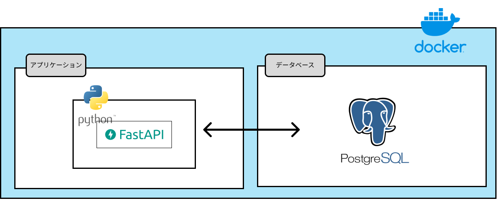

### 3. ORMツールを採用

SQLAlchemyを使用してデータベースとの連携を行うため、データの永続化や操作が容易です。

また、既存のDB定義からリバースエンジニアリングしてスキーマ定義を自動生成するようにしおり、スキーマを自前で作成することなくコマンド一つでORMを使用することができます。

DBデータサンプルでORMを操作するサンプルがあるので、SQLAlchemyを触ったことがない方でもすぐに理解することができます。

またDB設定情報の環境変数化やトランザクション処理などの面倒な記述や処理をテンプレート化しており、シンプルに記述することがで決ます。

### 4. 依存性の注入（DI）を採用してテストを簡単に

サンプルプログラムにはPythonの[Injector](https://pypi.org/project/injector/)ライブラリを使用して依存性の注入（DI）を行っています。

DIを利用することで、コードの分離とテストが容易になります。

### 5. ロギングのテンプレート化

事前に定義されたロギング設定により日時、関数、出力ファイル行が出力されます。

デコレータを使用することで、関数の実行・終了時にログの出力、エラーが投げられるとロギングしてからパススルーします。

```python
from app_server.share.logger_util import get_logger, log

logger = get_logger()

@log(logger, "メイン関数実行")
def main():
    logger.info("処理1")

if __name__ == "__main__":
    main()
```

```bash
# log/app_server.log
[2024-05-12 13:58:50,230] INFO	/workspaces/app-server/app_server/main2.py - main:12 -> [START]: main: メイン関数実行
[2024-05-12 13:58:50,232] INFO	main2.py - main:8 -> 処理1
[2024-05-12 13:58:50,232] INFO	/workspaces/app-server/app_server/main2.py - main:12 -> [END] main: メイン関数実行
```

### 6. 豊富なサンプルコード

- ルーティング
- ミドルウェア
- カスタムエラーハンドリング
- 認証・認可
- バリデーション
- Cookie
- ファイルアップロード
- ORMを使用したDB操作
- DBからモデル定義をリバースエンジニアリング
- 環境変数・設定の読み込み
- 依存性の注入（DI）

# クイックスタート

---

### 事前に必要なもの

- WSL2
- Docker Desktop（もしくは代替できるもの）
- VSCode

3点のインストールと最低限の設定は必要です。

各自インストールしてください。

---

1. クローンする。クローン先はWSL2上のフォルダに展開する（WIndows上フォルダでも可だが、それだとファイルの読み込み速度が20倍ほど違う。。）
2. ローカルでVSCodeを開き、Extensionsから【Remote Development】をinstallする


1. プロジェクトのルートディレクトリでVsCodeを開き、左下のマークから「コンテナを再度開く」を選択する。

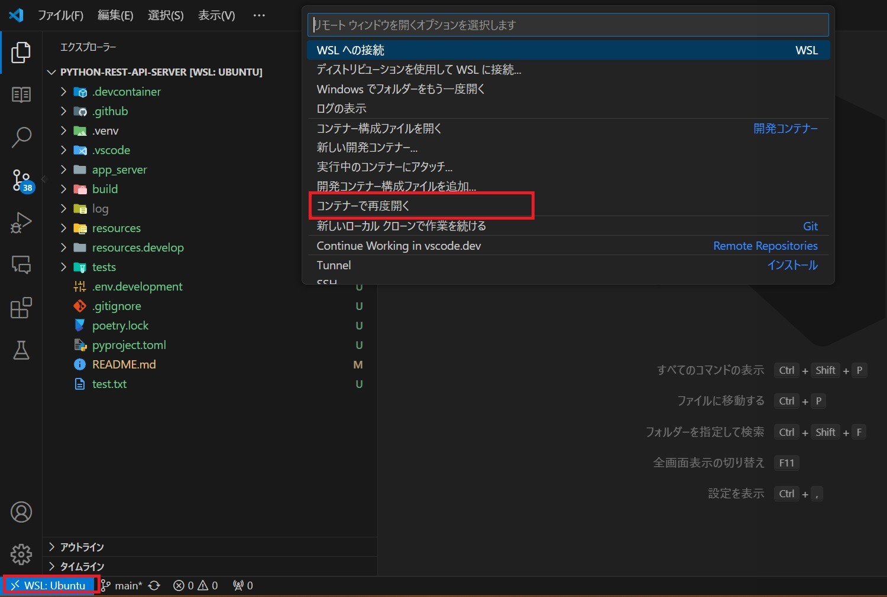

1. 開発コンテナが起動したら、uvを使用してPythonの依存関係をインストールします。

    ```bash
    uv sync
    ```

2. 左メニュー「実行とデバック」をクリック、「fastapi起動（デバッグモード）」を選択した状態で起動する。

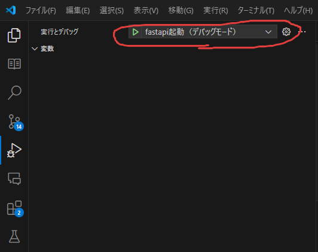

1. [localhost:8000/docs](http://localhost:8000/docslocalhost:8000/docs)に接続してSwaggerに接続できることを確認する。

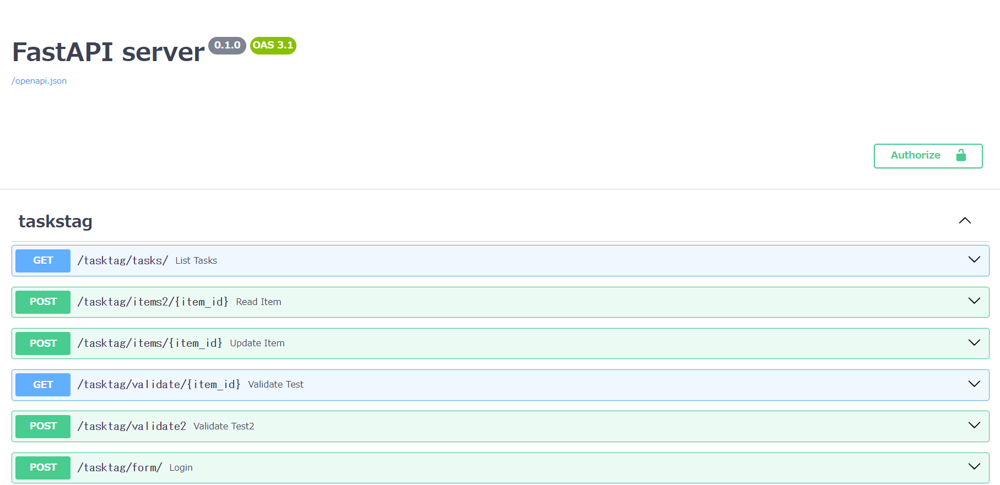

# ユーザガイド

## Fast API 基本機能

### 1. ルーティング

Fast APIはルーティング（REST APIエンドポイント）を下記のように記載します。

それぞれのエンドポイントのことを「オペレーション」といいます。

```python
from fastapi import FastAPI

app = FastAPI()

@app.get("/")
async def root():
    return {"message": "Hello World"}
```

[localhost:8000/](http://localhost:8000/)にGETでリクエストすると下記のようになります。

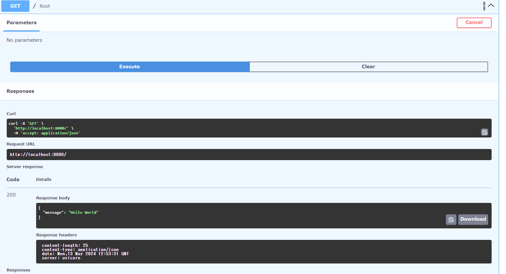

テンプレートではパスオペレーション関数を別ファイルで管理しています。

```python
.
├── main.py
└── routers
    └── task_router.py # 機能ごとにルーターを別々に管理する
```

### 2. ミドルウェア

Fast APIではすべてのリクエストに対して、ルーティングによって処理される前に実行する巻子を定義する[ミドルウェア](https://fastapi.tiangolo.com/ja/tutorial/middleware/?h=%E3%83%9F%E3%83%89%E3%83%AB%E3%82%A6%E3%82%A7%E3%82%A2)という機能を追加することができます。

- ミドルウェアは下記のような用途に使用できる。
    - 認証と認可
    - ロギングとトレース
    - キャッシング

テンプレートではレスポンスに処理時間を表す”X-Process-Time”ヘッダを付与するミドルウェアの例があります。

```python
# app_server/app/middleware.py
import time
from fastapi import Request
from app_server.main import app

@app.middleware("http")
async def add_process_time_header(request: Request, call_next):
    start_time = time.time()
    response = await call_next(request)
    process_time = time.time() - start_time
    response.headers["X-Process-Time"] = str(process_time)
    return response

```

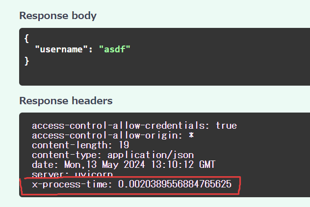

### 3. エラーハンドリング

FastAPIでは予期せぬエラーが発生した場合（例えば、実行エラー：UnicornException、HTTPエラー:StarletteHTTPException、検証エラー:RequestValidationError）でも意図したレスポンス形式にしたい場合にはエラーハンドリングを用います。

エラーハンドリングは特定のエラーが発生した際にレスポンスをカスタマイズすることができます。

テンプレートでは下記のようにUnicornExceptionをカスタマイズしています。

```python
@app.exception_handler(UnicornException)
async def unicorn_exception_handler(request: Request, exc: UnicornException):
    # content配下がレスポンス内容になる
    return JSONResponse(
        status_code=418,
        content={"message": f"Oops! {exc.name} did something. There goes a rainbow..."},
    )
```

実行すると以下のように指定した形式のレスポンスが返ってきます。

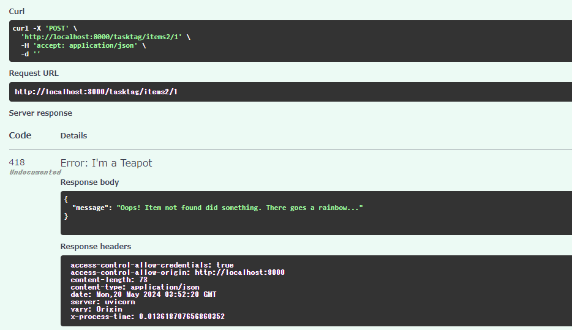

### 4. 認証・認可

OAuth2による認証・認可の処理を定義しています。

---

**!!Tips!! ～OAuth2のパスワードフローについて～**

1. ユーザはフロントエンドで`ユーザ名`と`パスワード`を入力をします。
2. APIは`ユーザ名`と`パスワード`をチェックし、**認証したことを示す「トークン」を返却します。**
    1. テンプレートでは**jwtトークン**を使用します [2]
3. フロントエンドはトークンをCookieなどの一時領域に保存します。
4. ユーザがフロントエンドのリンクをクリックして、別のセクションに移動します。
5. フロントエンドはHTTPヘッダーの`Authorization`に`Bearer`の文字列とトークンを加えた値をAPIエンドポイントに送信してバックエンドで**認可します。**
[3]

---

FastAPIではBearerトークンを使用してOAuth2パスワードフローで認証するために`OAuth2PasswordBearerクラス`を使用します。

`OAuth2PasswordBearer` インスタンスを作成する際に認証URLを指定します。

```python
# app_server/routers/task_router.py
router = APIRouter(
    prefix="/tasktag",
    tags=["taskstag"],
    include_in_schema=CommonUtil.is_debug(),  # デバッグモードの場合のみ表示する
)

# 認証URLの指定
oauth2_scheme = OAuth2PasswordBearer(tokenUrl="/tasktag/login")
```

パスオペレーション関数で認証URLを実装します。

```python
# app_server/routers/task_router.py
# ログインのエンドポイント
@router.post("/login/")
async def login_for_access_token(form_data: Annotated[OAuth2PasswordRequestForm, Depends()]) -> Token:
    # 認証サービスをDI
    authService: AuthService = g.injector.resolve(AuthService)
    # JWTトークンで認証処理
    token = authService.login(form_data.username, form_data.password)
    if not token:
        raise HTTPException(
            status_code=status.HTTP_401_UNAUTHORIZED,
            detail="Incorrect username or password",
            headers={"WWW-Authenticate": "Bearer"},
        )
    return Token(access_token=token)
```

設定するとSwaggerで鍵マークとともに認証ダイアログでログイン処理を確認することができます。

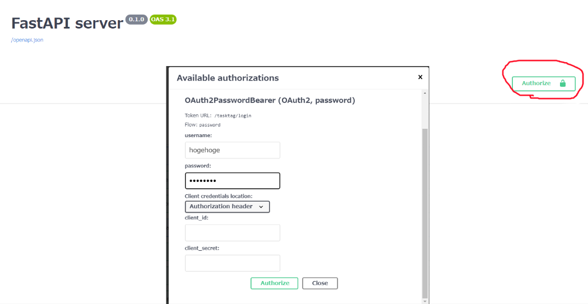

トークンを利用した認可処理は下記のように行います。[4]

```python
# app_server/routers/task_router.py
# フロントエンドはヘッダーに"Bearer <Token>"と付与する必要がある(Swaggerでは自動で付与される)
async def get_current_user(token: str = Depends(oauth2_scheme)) -> str:
    """トークンからユーザIDを取得"""
    authService: AuthService = g.injector.resolve(AuthService)
    if not authService.is_valid_token(token):
        raise HTTPException(
            status_code=status.HTTP_401_UNAUTHORIZED,
            detail="Could not validate credentials",
            headers={"WWW-Authenticate": "Bearer"},
        )
    # トークンではなくユーザモデルを返すことでユーザ情報を参照することができるようになる
    return token

# 認可が必要なエンドポイント
@router.get("/auth/")
async def auth_test(token: Annotated[str, Depends(get_current_user)]):
    return {"token": token}
```

### 5. バリデーション

FastAPIではリクエストの内容を検証するバリデーション機能があります。

バリデーションには
①パスオペレーション関数の引数で指定する方法 [5]
②モデルで指定する方法 [6]

がある。

```python
# app_server/routers/task_router.py
from fastapi import APIRouter, Cookie, Depends, File, Form, HTTPException, Path, Query, Response, UploadFile, status
from pydantic import BaseModel, Field, field_validator
...
class User(BaseModel):
    name: str = Field(..., min_length=4, max_length=16)  # 4~16文字のstr型
    age: int = Field(..., ge=18, le=99)  # 18~99のint型
    birthday: date  # = Field(..., description="The user's birthday")  # date型

    @field_validator("name")
    @classmethod
    def validate_alphanumeric(cls, v: str) -> str:
        """アルファベットもしくは数字のみで構成された文字列であるかチェックする"""
        if not v.isalnum():
            raise ValueError("must be alphanumeric")
        return v
...

# 検証
# RequestValidationErrorハンドラーでキャッチしてくれる
# パスオペレーション関数の引数で指定する方法
@router.get("/validate/{item_id}")
async def validate_test(
    item_id: int = Path(title="The ID of the item to get", gt=0, le=1000),
    q: Union[int, None] = Query(default=None, alias="item-query"),
):
    results = {"item_id": item_id}
    if q:
        results.update({"q": q})  # type: ignore
    return results

# 検証
# RequestValidationErrorハンドラーでキャッチしてくれる
# モデルで指定する方法
@router.post("/validate2")
async def validate_test2(user: User):
    return user.model_dump()
```

実行結果

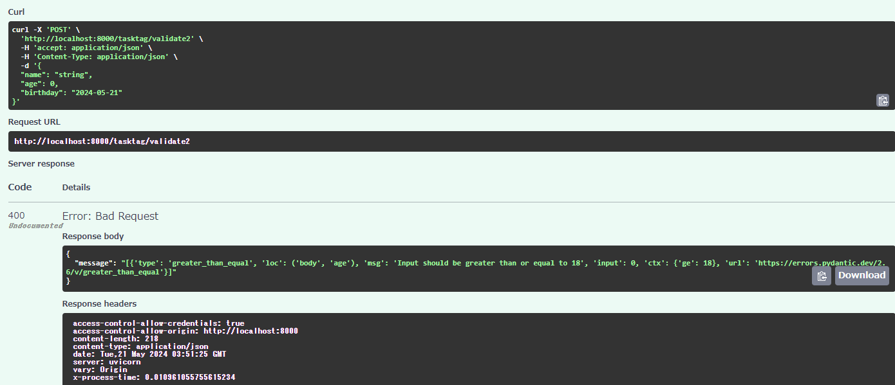

### 6. Cookie

クッキーのパラメータはクエリパラメータやパスパラメータと同じように定義することができます。

```python
# app_server/routers/task_router.py
from fastapi import APIRouter, Cookie, Depends, File, Form, HTTPException, Path, Query, Response, UploadFile, status
...
@router.get("/cookie/")
async def cookie(ads_id: Union[str, None] = Cookie(default=None)):
    return {"ads_id": ads_id}
```

- 実行結果

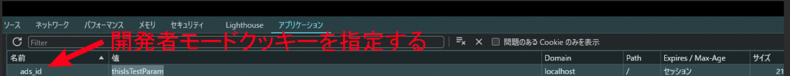

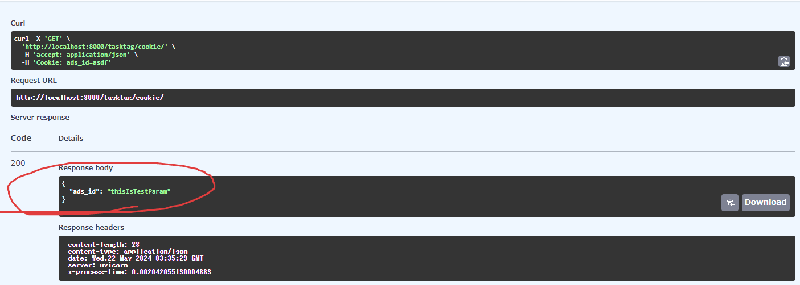

### 7. ファイルアップロード

Fast APIではファイルアップロード方法がいくつかあります。[7]

1. **uploadFile()**

ファイル内容の他にファイル名などのメタデータを取得することもできます。

アップロードされたファイルはメモリに展開されたあと、メモリの最大値を超える場合にはファイルとして保存されるので巨大なバイナリファイルや画像に対応できます。

```python
# app_server/routers/task_router.py
from typing import Annotated
from fastapi import FastAPI, File, UploadFile
...
# ファイルアップロード
# こっちのほうがメモリ保存領域を超えた場合にファイルに保存する機能があるので良いらしい
@router.post("/uploadfile/")
async def create_upload_file(file: UploadFile):
    return {"filename": file.filename}
```

1. **File()**

`bytes`型として読み出すことができる。

**アップロードファイルは全てメモリに展開される**ので小さいファイルを扱う場合のみ使用できる

```python
# app_server/routers/task_router.py
from typing import Annotated
from fastapi import FastAPI, File, UploadFile
...
# ファイルアップロード
# ファイルは全てメモリに展開される
@router.post("/files/")
async def create_file(file: Annotated[bytes, File()]):
    return {"file_size": len(file)}
```

## DB操作

テンプレートをVSCode + devContainerで立ち上げると、あらかじめデータが入ったPostgreSQLも並行して立ち上がります。データは以下の形式になります。[8]

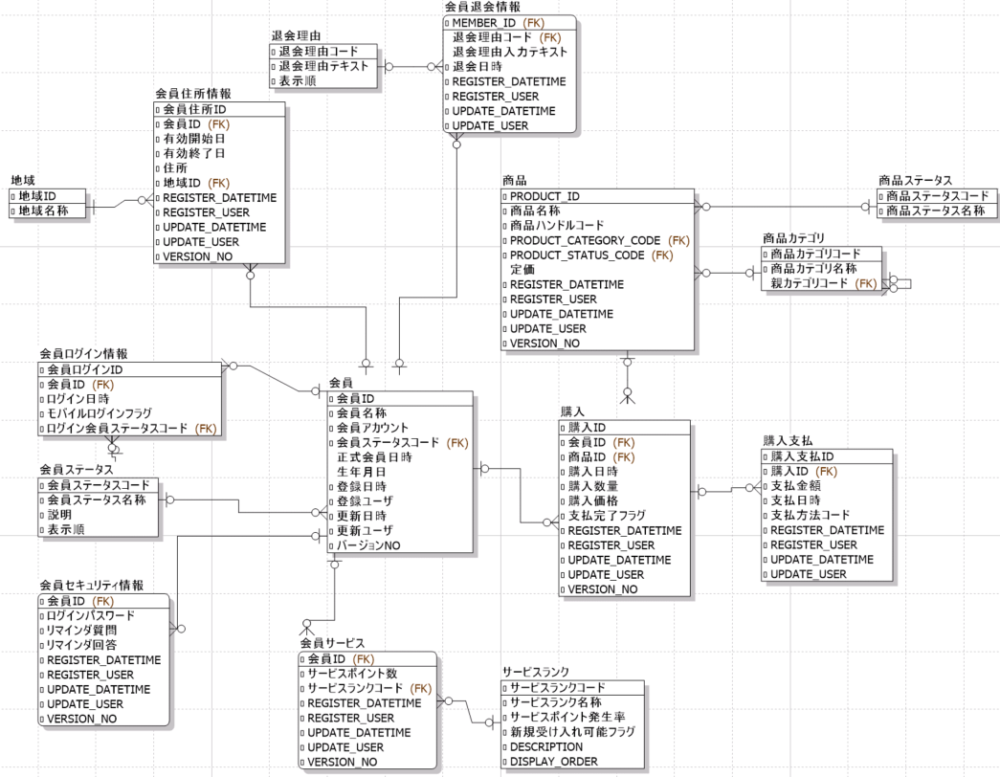

DB操作はSQLAlchemyというライブラリを利用します。

SQLAlchemyを利用することでSQL文を書かずに（書くこともできます）タイプセーフな記述の方法を利用します。

### 1. SQL Alchemyとは

SQLAlchemyは、Pythonプログラムでデータベースを操作するための強力なライブラリです。

主な特徴は以下になります。[9]

1. 固有のDBMS製品に依存しないデータ操作（クエリの作成）が可能
2. 動的SQLではなくPythonのコーディングでクエリ作成が可能
3. ORMツールだが、細かいチューニングもできる（SQL Expression Languageを使用）
4. デフォルトでSQLインジェクション対策も実装されている
5. 2006年から継続開発されている実績と信頼がある

詳細は[詳細-DB操作](docs/詳細-DB操作.md)をご覧ください。

### 2. DBからモデル定義をリバースエンジニアリング

SQL AlchemyのORMという機能を利用した問合せを利用する場合、事前にデータベースのテーブル構造に沿ったクラスモデルを手動で定義する必要があります。

上記を[sqlacodegen](https://github.com/agronholm/sqlacodegen)というライブラリを使用することで、データベースからモデル定義をリバースエンジニアリングすることができます。

**使用方法**

1. [環境変数](assets/image.md)にDB接続情報を定義する。
2. 左メニュー「実行とデバック」をクリック、「スキーマ作成」を選択した状態で起動する。

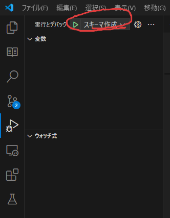

1. `app_server/database/db_schema.py`にデータベースのモデル定義が自動で作成されていることを確認する。

```python
from typing import List, Optional

from sqlalchemy import CHAR, Date, DateTime, ForeignKeyConstraint, Index, Integer, Numeric, PrimaryKeyConstraint, String, Text, UniqueConstraint
from sqlalchemy.orm import DeclarativeBase, Mapped, mapped_column, relationship
import datetime
import decimal

class Base(DeclarativeBase):
    pass

class MemberStatus(Base):
    __tablename__ = 'member_status'
    __table_args__ = (
        PrimaryKeyConstraint('member_status_code', name='member_status_pkc'),
        UniqueConstraint('display_order', name='display_order'),
        {'comment': '会員ステータス'}
    )

    member_status_code: Mapped[str] = mapped_column(CHAR(3), primary_key=True, comment='会員ステータスコード: 会員ステータスを識別するコード。')
    member_status_name: Mapped[str] = mapped_column(String(50), comment='会員ステータス名称')
    description: Mapped[str] = mapped_column(String(200), comment='説明: 会員ステータスそれぞれの説明。気の利いた説明があるとディベロッパーがとても助かる。')
    display_order: Mapped[int] = mapped_column(Integer, comment='表示順: UI上のステータスの表示順を示すNO。並べるときは、このカラムに対して昇順のソート条件にする。')

    member: Mapped[List['Member']] = relationship('Member', back_populates='member_status')
    member_login: Mapped[List['MemberLogin']] = relationship('MemberLogin', back_populates='member_status')

class ProductCategory(Base):
    __tablename__ = 'product_category'
    __table_args__ = (
        ForeignKeyConstraint(['parent_category_code'], ['product_category.product_category_code'], name='product_category_fk1'),
        PrimaryKeyConstraint('product_category_code', name='product_category_pkc'),
        Index('fk_product_category_parent', 'parent_category_code'),
        {'comment': '商品カテゴリ: 商品のカテゴリを表現するマスタ。自己参照の階層になっている。'}
    )

    product_category_code: Mapped[str] = mapped_column(CHAR(3), primary_key=True, comment='商品カテゴリコード')
    product_category_name: Mapped[str] = mapped_column(String(50), comment='商品カテゴリ名称')
    parent_category_code: Mapped[Optional[str]] = mapped_column(CHAR(3), comment='親カテゴリコード: 最上位の場合はデータなし。')

    product_category: Mapped['ProductCategory'] = relationship('ProductCategory', remote_side=[product_category_code], back_populates='product_category_reverse')
    product_category_reverse: Mapped[List['ProductCategory']] = relationship('ProductCategory', remote_side=[parent_category_code], back_populates='product_category')
    product: Mapped[List['Product']] = relationship('Product', back_populates='product_category')

...
```

## その他

### 1. Pythonパッケージング管理ツール

テンプレートではPythonのライブラリ管理に[uv](https://docs.astral.sh/uv/)というパッケージ管理ツールを使用しています。

uvは、pipに替わるインストールツール + パッケージ管理を簡素化するツールです。
今までパッケージ管理にはpyenv + poetryやpyenv + pipenv、rye + uvなどの組み合わせで構築が必要だったものが、uvだけでPythonインタープリタ含めて管理することが可能です。

### 2. 環境変数・設定の読み込み

テンプレートでは環境変数・設定の読み込みの方法も事前に用意されています。

**環境変数**

環境変数は`python-dotenv` というライブラリを使用して読み込んでいます。

環境変数はトップディレクトリにある`.env*`ファイルに記載することで実行時に自動的に読み込まれるようになっています。

| ファイル名 | 環境 | 概要 |
| --- | --- | --- |
| .env | production環境 | リポジトリには含まれていません（.envはプロジェクトに含めないのが一般的）[10] |
| .env.development | development環境 | リポジトリには含まれていません  |

```bash
# .env.development
# JWT情報
JWT_SECRET_KEY=secretKey

# DBタイプ
# postgresql: PostgreSQL
# mysql: MySQL
DB_TYPE=postgresql

# DB接続情報
DB_HOST=app-db
DB_PORT=5432
DB_USER=postgres
DB_PASSWORD=postgres
DB_NAME=app-postgres

```

development環境の設定は環境変数が`IS_DEBUG=TRUE` の場合に読み込まれるようにしています。

`IS_DEBUG` は.envファイルではなく`.vscode/launch.json`に定義されています。

**vscodeでの実行時にproduction環境とdevelopment環境を使い分けます。**

テンプレートでは環境変数の値は直接使用せずに`const.py`に集約してから定数として使用するようにしています。

- こうすることで**`const.py`以外で何の環境変数が定義されているかを気にする必要がなくなります。**

```python
# app_server/share/const.py
import os

from dotenv import load_dotenv

def is_debug() -> bool:
    """デバッグモードか判断する
    循環参照回避のため直接isDebug関数を記述

    Returns:
        bool: true:デバッグモード
    """
    return os.getenv(IS_DEBUG) == "TRUE"

def getenv(key: str) -> str:
    value = os.getenv(key)
    if value is None:
        raise ValueError(f"Environment variable {key} is not set.")
    return value
...
"""DBタイプ"""
DB_TYPE = getenv("DB_TYPE")

"""データベース接続情報"""
DB_HOST = getenv("DB_HOST")
DB_PORT = getenv("DB_PORT")
DB_USER = getenv("DB_USER")
DB_PASSWORD = getenv("DB_PASSWORD")
DB_NAME = getenv("DB_NAME")
```

**設定**

設定はproduction環境用が`/resouces/setting.ini`、development環境用が`/resources.develop/setting.ini`に用意されています。

```bash
# 本番用
resources
└── setting.ini

# デバッグ用環境変数
resources.develop/
└── setting.ini
```

```bash
# resources/setting.ini
[TEST]
testrow=testProduction

# resources.develop/setting.ini
[TEST]
testrow=testDevelop
```

設定読み込み例として`/setting/`のパスオペレーション関数（エンドポイント）があります。
設定を読み込み出力します。

```python
# app_server/routers/task_router.py
# 設定ファイル読み込み
@router.get("/setting/")
async def get_setting():
    logger.info("設定ファイル読み込み")
    testrow = FileIoUtil.get_properties(const.SETTING_PATH, "TEST", "testrow")
    logger.info(f"[TEST]:testrow`{testrow}`")
    return f"[TEST]:testrow`{testrow}`"
```

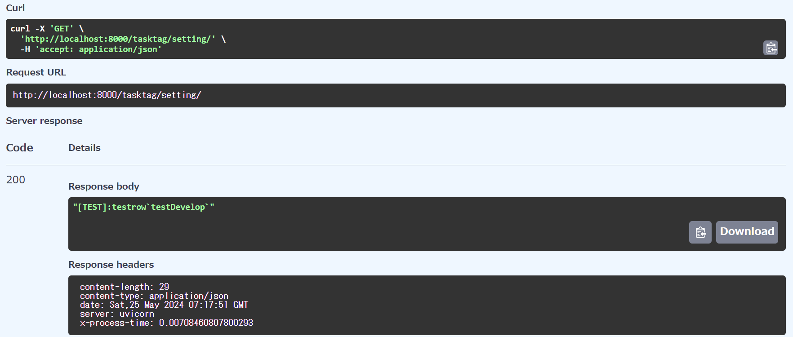

### 3. 依存性の注入（DI）

**※pythonライブラリ[Injector](https://github.com/python-injector/injector)についての説明です。**

**※Fast APIのdependenciesの説明ではありません。**

`Injector` というpythonライブラリを使用して、インターフェースを定義してproduction環境用、development環境用とそれぞれ別々に宣言されたクラスを用意することで、テストや動作検証を簡単に行えるようになっています。

---

**!!Tips!! ～DI例～**

- 例えば、production環境ではMySQL、development環境ではインメモリDBを使用したい場合は以下のようにすることで使い分けることができます。

```python
# インターフェース
class DBRepository(metaclass=ABCMeta):
    @abstractmethod
    async def connect():
        raise NotImplementedError

# production用
class MySQLRepository(DBRepository): # DBRepositoryを実装
    @abstractmethod
    async def connect():
        # 具体的処理を記述

# development用
class InMemoryRepository(DBRepository): # DBRepositoryを実装
    @abstractmethod
    async def connect():
        # 具体的処理を記述

# DI設定
def config(binder):
    binder.bind(Configuration, to=DBRepository, scope=MySQLRepository if not CommonUtil.is_debug() else InMemoryRepository)

injector = Injector(config)
# 依存環境の解決
db = injector.get(DBRepository)
# development環境の場合、インメモリDBのインスタンスになる
db.connect()
```

詳細な使い方に関しては[詳細-DI](docs/詳細-DB操作.md)を確認してください。

---

テンプレートではDIの設定を`di.py`でしています。

```python
# app_server/config/di.py
class DI:
    """Dependency Injectionを実現する"""

    def __init__(self) -> None:
        # 依存関係を設定する関数を読み込む
        self.injector = Injector(self.__class__.config)

    # 依存関係を設定するメソッド
    @classmethod
    def config(cls, binder: Binder):
        if CommonUtil.is_debug():
            # サービス
            binder.bind(interface=AuthService, to=DebugAuthService)
            binder.bind(interface=MemberService, to=ProductionMemberService)
            # # リポジトリ
            binder.bind(interface=MemberRepository, to=ProductionMemberRepository)
        else:
            # サービス
            binder.bind(interface=AuthService, to=ProductionAuthService)
            binder.bind(interface=MemberService, to=ProductionMemberService)
            # # リポジトリ
            binder.bind(interface=MemberRepository, to=ProductionMemberRepository)

        # DB設定
        if DBType.POSTGRESQL == const.DB_TYPE:
            # PostgreSQL
            binder.bind(interface=AsyncDBConfig, to=ProductionAsyncPostgresqlDBConfig)
            binder.bind(interface=DBConfig, to=ProductionPostgresqlDBConfig)
        elif DBType.MYSQL == const.DB_TYPE:
            # MySQL
            binder.bind(interface=AsyncDBConfig, to=ProductionAsyncMySqlDBConfig)
            binder.bind(interface=DBConfig, to=ProductionMySqlDBConfig)
        else:
            raise ValueError(f"DB_TYPEの値が不正です。DB_TYPE={const.DB_TYPE}")

    # injector.get()に引数を渡すと依存関係を解決してインスタンスを生成する
    def resolve(self, cls):
        return self.injector.get(cls)
```

`global_value.py`で上記の**DIクラスのインスタンスを一度定義したら使いまわすためにグローバル変数として定義しています。**

`main.py`でグローバル変数で定義します。

```python
# app_server/share/global_value.py
from app_server.config.di import DI

injector: DI
```

```python
# app_server/main.py
import app_server.share.global_value as g

# DIの初期化
g.injector = DI()
```

使用例

```python
# app_server/routers/task_router.py

# DB接続テスト
@router.get("/findAll/")
async def get_member_list():
    memberService: MemberService = g.injector.resolve(MemberService)
    return memberService.find_all()
```

# リファレンス

- [詳細-uv](docs/詳細-uv.md)
- [詳細-DB操作](docs/詳細-DB操作.md)
- [詳細-DI](docs/詳細-DI.md)

# 引用

[1] [https://fastapi.tiangolo.com/ja/](https://fastapi.tiangolo.com/ja/)

[2] [https://qiita.com/asagohan2301/items/cef8bcb969fef9064a5c](https://qiita.com/asagohan2301/items/cef8bcb969fef9064a5c)

[3] [https://fastapi.tiangolo.com/ja/tutorial/security/first-steps/#_4](https://fastapi.tiangolo.com/ja/tutorial/security/first-steps/#_4)

[4] [https://fastapi.tiangolo.com/ja/tutorial/security/get-current-user/#_1](https://fastapi.tiangolo.com/ja/tutorial/security/get-current-user/#_1)

[5] [https://fastapi.tiangolo.com/ja/tutorial/query-params-str-validations/](https://fastapi.tiangolo.com/ja/tutorial/query-params-str-validations/)

[6] [https://qiita.com/uenosy/items/2f6b1aa258018d3db76c](https://qiita.com/uenosy/items/2f6b1aa258018d3db76c)

[7] [https://fastapi.tiangolo.com/ja/tutorial/request-files/](https://fastapi.tiangolo.com/ja/tutorial/request-files/)

[8] [https://dbflute.seasar.org/ja/tutorial/handson/section01.html](https://dbflute.seasar.org/ja/tutorial/handson/section01.html)

[9] [https://zenn.dev/myuki/books/02fe236c7bc377/viewer/27b8c3](https://zenn.dev/myuki/books/02fe236c7bc377/viewer/27b8c3)

[10] [https://github.com/github/gitignore/blob/main/Python.gitignore#L125](https://github.com/github/gitignore/blob/main/Python.gitignore#L125)
