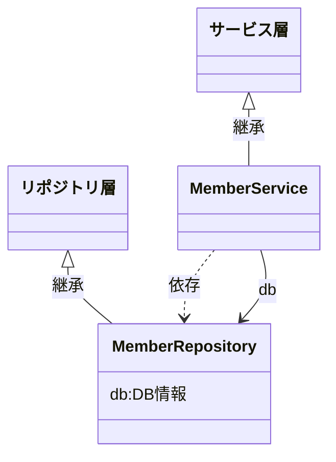

# 詳細-DB操作

- [詳細-DB操作](#詳細-db操作)
- [概要](#概要)
  - [FAQ](#faq)
- [ユーザガイド](#ユーザガイド)
  - [データ準備](#データ準備)
  - [接続](#接続)
  - [リバースエンジニアリング](#リバースエンジニアリング)
  - [簡易的なCRUD処理](#簡易的なcrud処理)
  - [サンプル実装](#サンプル実装)
- [ドキュメント](#ドキュメント)
  - [トランザクション](#トランザクション)
  - [非同期処理について](#非同期処理について)
- [引用](#引用)

# 概要

[SQLAlchemy公式サイト](https://docs.sqlalchemy.org/en/20/index.html)

[Github](https://github.com/sqlalchemy/sqlalchemy/)

[SQLAlchemy](https://docs.sqlalchemy.org/en/20/index.html)は、Pythonプログラムでデータベースを操作するための強力なライブラリです。

主な特徴は以下になります。[1]

1. 固有のDBMS製品に依存しないデータ操作（クエリの作成）が可能
2. 動的SQLではなくPythonのコーディングでクエリ作成が可能
3. ORMツールだが、細かいチューニングもできる（SQL Expression Languageを使用）
4. デフォルトでSQLインジェクション対策も実装されている
5. 2006年から継続開発されている実績と信頼がある

SQLAlchemyでは問合せ方法が2種類あります。

1. **SQL Expression Language (SQL文言言語)：**
    - 生のSQL文を書くことなく、Pythonのオブジェクトやメソッドを使ってSQLクエリを構築できます。
    - SQLAlchemyの低レベルAPIで、柔軟で細かい制御が可能です。
    - **返ってくる値はAny型なので、テーブル構造を意識する必要がある**
2. **Object Relational Mapper (ORM)：**
    - Pythonのクラスモデルとデータベースのテーブルをマッピングすることで、データベースのレコードをPythonオブジェクトとして扱えるようにします。
    - **返ってくる値は事前に定義されたモデル型なので、テーブル構造を意識する必要がない**

```python
# ORM例
# ユーザーを全て取得
users = session.query(User).all()
for user in users:
		# userは事前に定義されているモデルでuser配下のフィールドをIDEで補間することができる
    print(user.name)
# ユーザーを取得して更新
user_to_update = session.query(User).filter_by(name='John Doe').first()
user_to_update.age = 31
session.commit()
```

## FAQ

なぜSQL文を実行するだけのシンプルなライブラリにしないのか？

- ORMを使用することができるから。
    - SQLの実行、実行結果をタイプセーフに書くことができる。
    - タイプセーフとは事前に型が定義されていることで、IDEなどで補完が効くようになることです。結果としてヒューマンエラーを減らすことができます。
- ORMで実現できない細かい挙動もSQL Expression Languageで実現することができる。
- デメリットは学習コストがかかること
    - テンプレートでSQLAlchemyによる**構文の理解に必要なサンプルが用意されているのでなるべく学習コストがかからないようになっています。**

# ユーザガイド

## データ準備

テンプレートをVSCode + devContainerで立ち上げると、あらかじめデータが入ったPostgreSQLも並行して立ち上がります。データは以下の形式になります。[2]


動作検証に使用してください。

## 接続

接続情報は環境変数に記載します。

接続情報に必要な環境変数は以下になります。

| 環境変数名 | 概要 | 初期値 |
| --- | --- | --- |
| DB_TYPE | postgresql: PostgreSQL, 
mysql: MySQL | postgresql |
| DB_HOST | ホスト名 | app-db |
| DB_PORT | ポート番号 | 5432 |
| DB_USER | ユーザ名 | postgres |
| DB_PASSWORD | パスワード | postgres |
| DB_NAME | データベース名 | app-postgres |

環境変数はproduction環境なら`.env`、development環境なら`.env.development`に記載することをおすすめします。

pythonプログラム実行時に`const.py`が自動的に環境変数を読み込んでくれます。

## リバースエンジニアリング

SQL AlchemyのORMという機能を利用した問合せを利用する場合、事前にデータベースのテーブル構造に沿ったクラスモデルを手動で定義する必要があります。

上記を[sqlacodegen](https://github.com/agronholm/sqlacodegen)というライブラリを使用することで、データベースからモデル定義をリバースエンジニアリングすることができます。

**使用方法**

1. [環境変数](#接続)にDB接続情報を定義する。
2. 左メニュー「実行とデバック」をクリック、「スキーマ作成」を選択した状態で起動する。


1. `app_server/database/db_schema.py`にデータベースのモデル定義が自動で作成されていることを確認する。

```python
from typing import List, Optional

from sqlalchemy import CHAR, Date, DateTime, ForeignKeyConstraint, Index, Integer, Numeric, PrimaryKeyConstraint, String, Text, UniqueConstraint
from sqlalchemy.orm import DeclarativeBase, Mapped, mapped_column, relationship
import datetime
import decimal

class Base(DeclarativeBase):
    pass

class MemberStatus(Base):
    __tablename__ = 'member_status'
    __table_args__ = (
        PrimaryKeyConstraint('member_status_code', name='member_status_pkc'),
        UniqueConstraint('display_order', name='display_order'),
        {'comment': '会員ステータス'}
    )

    member_status_code: Mapped[str] = mapped_column(CHAR(3), primary_key=True, comment='会員ステータスコード: 会員ステータスを識別するコード。')
    member_status_name: Mapped[str] = mapped_column(String(50), comment='会員ステータス名称')
    description: Mapped[str] = mapped_column(String(200), comment='説明: 会員ステータスそれぞれの説明。気の利いた説明があるとディベロッパーがとても助かる。')
    display_order: Mapped[int] = mapped_column(Integer, comment='表示順: UI上のステータスの表示順を示すNO。並べるときは、このカラムに対して昇順のソート条件にする。')

    member: Mapped[List['Member']] = relationship('Member', back_populates='member_status')
    member_login: Mapped[List['MemberLogin']] = relationship('MemberLogin', back_populates='member_status')

class ProductCategory(Base):
    __tablename__ = 'product_category'
    __table_args__ = (
        ForeignKeyConstraint(['parent_category_code'], ['product_category.product_category_code'], name='product_category_fk1'),
        PrimaryKeyConstraint('product_category_code', name='product_category_pkc'),
        Index('fk_product_category_parent', 'parent_category_code'),
        {'comment': '商品カテゴリ: 商品のカテゴリを表現するマスタ。自己参照の階層になっている。'}
    )

    product_category_code: Mapped[str] = mapped_column(CHAR(3), primary_key=True, comment='商品カテゴリコード')
    product_category_name: Mapped[str] = mapped_column(String(50), comment='商品カテゴリ名称')
    parent_category_code: Mapped[Optional[str]] = mapped_column(CHAR(3), comment='親カテゴリコード: 最上位の場合はデータなし。')

    product_category: Mapped['ProductCategory'] = relationship('ProductCategory', remote_side=[product_category_code], back_populates='product_category_reverse')
    product_category_reverse: Mapped[List['ProductCategory']] = relationship('ProductCategory', remote_side=[parent_category_code], back_populates='product_category')
    product: Mapped[List['Product']] = relationship('Product', back_populates='product_category')

...
```

## 簡易的なCRUD処理

[SQLAlchemyの基本的な使い方](https://qiita.com/arkuchy/items/75799665acd09520bed2) 参照

## サンプル実装

テンプレートでは3層アーキテクチャ構造をしているので、サービス層からリポジトリ層にあるDB操作処理を使用するようにしています。



リポジトリ層では各メソッドでDB情報を引数として渡すことを強制しています。

⇒サービス層でDB情報をDIで定義してリポジトリ層に渡すようにしています。

```python
# app_server/service/test_member_service.py
@inject
@dataclass
class ProductionMemberService(MemberService):
    # @injectによりリポジトリ、DB設定がDIによって自動的に定義される
    member_repository: MemberRepository
    db: DBConfig

    def find_by_id(self, id: int) -> Optional[Member]:
        return self.member_repository.find_by_id(self.db, id)  # type: ignore

    def find_all(self) -> List[Member]:
        return self.member_repository.find_all(self.db)
...
```

```python
# app_server/repository/test_member_repository.py
class ProductionMemberRepository(MemberRepository):
    """Memberクラス 本番用"""

    def find_by_id(self, db: DBConfig, id: int) -> Optional[Member]:
		    """1件検索"""
        session = db.get_db()
        query = select(Member).where(Member.member_id == id)
        result = session.execute(query)
        return result.scalars().first()

    def find_all(self, db: DBConfig) -> List[Member]:
		    """全件検索"""
        session = db.get_db()
        query = select(Member)
        result = session.execute(query)
        return list(result.scalars().all())
...
```

サンプルとして以下を用意してあります。

1. 1件検索
2. 全件検索
3. 更新
4. N:1検索
5. 1:N検索
6. 1:N:1検索

サンプル例は`app_server/service/test_member_service.py` を確認してください。

# ドキュメント

## トランザクション

通常、DB操作においてUPDATE・DELETE処理は完了したらコミット、例外が発生したらロールバック（トランザクション）する必要があります。

テンプレートでは**UPDATE・DELETEのメソッドに`@transaction`を付与することでトランザクションが実行されるようにしています。**

⇒デコレータ化することでトランザクション処理を毎度書く必要がなくなります。

```python
from app_server.database.transaction import transaction
...
# app_server/service/test_member_service.py
@inject
@dataclass
class ProductionMemberService(MemberService):
...
    # トランザクションを開始する
    @transaction
    def update(self, user_sample: Member):
        self.member_repository.update(self.db, user_sample)
```

---

**!!Tipa!!～トランザクション処理について～**

**`@transaction`** のデコレータは引数にDB情報を受け取っていないにも関わらず、コミット、ロールバックができているのはなぜでしょうか？

理由は`app_server/database/transaction.py` のデコレーターの処理にあります。

`transaction.py`では引数でデコレーター情報を受け取ることもできますが、引数で受け取らない場合は**メソッドが所属しているクラスのフィールドからdb情報を自動的に読み取るようにしています。**

こうすることでDIでインジェクションした後に定義されたDB情報からセッションを取得してトランザクションすることができます。

興味のある方は処理を確認してみてください。

---

## 非同期処理について

SQLAlchemyでは非同期処理にも対応しており、テンプレートでも非同期処理のサンプルがある。

```python
# app_server/routers/task_router.py
@router.get("/db/asyncFindAll/", summary="非同期で処理を実行します")
async def async_get_member_list():
    memberService: MemberService = g.injector.resolve(MemberService)
    return await memberService.async_find_all()
```

```python
# app_server/service/test_member_service.py
class ProductionMemberService(MemberService):
    # @injectによりリポジトリ、DB設定がDIによって自動的に定義される
    member_repository: MemberRepository
    db: DBConfig
    async_db: AsyncDBConfig

    ...
    async def async_find_all(self) -> List[Member]:
        return await self.member_repository.async_find_all(self.async_db)
```

```python
# app_server/repository/test_member_repository.py
class ProductionMemberRepository(MemberRepository):
    """Memberクラス 本番用"""

    ...
    async def async_find_all(self, db: AsyncDBConfig) -> List[Member]:
        session = db.get_db()
        query = select(Member)
        result = await session.execute(query)
        return list(result.scalars().all())

```

---

**!!Tips!!～FastAPIの非同期処理について～**

FastAPIで非同期処理を行うにはパスオペレーション関数に`async` を付与すればよい。

```python
@app.get('/')
async def read_results():
    results = await some_library()
    return results
```

FastAPIでは同期処理だとリクエストごとにスレッドが作成されますが、非同期処理だとメインスレッドで実行されます。[3]

またFastAPIでは処理時間が

**非同期処理 >>> 同期処理 >>>>>>>> 非同期定義 + 同期処理**

となっています。[4]

**つまり非同期のパスオペレーション関数に通信時間やDB・ストレージの書き込み処理（I/Oバンドといいます）などの処理の重い同期処理を実行してはいけません**

⇒並列・平行処理をしなくなるので、待ち時間がリクエスト×処理時間となってしまう。

非同期のパスオペレーション関数では重い処理が非同期処理に対応しているか確認する必要があります。

**よくわからないという人はパスオペレーション関数を同期定義で書くことをおすすめします。**

---

# 引用

[1] [https://zenn.dev/myuki/books/02fe236c7bc377/viewer/27b8c3](https://zenn.dev/myuki/books/02fe236c7bc377/viewer/27b8c3)

[2] [https://dbflute.seasar.org/ja/tutorial/handson/section01.html](https://dbflute.seasar.org/ja/tutorial/handson/section01.html)

[3] [https://fastapi.tiangolo.com/ja/async/](https://fastapi.tiangolo.com/ja/async/)

[4] [https://qiita.com/ikora128/items/35b02714eee7d44f44d6](https://qiita.com/ikora128/items/35b02714eee7d44f44d6)